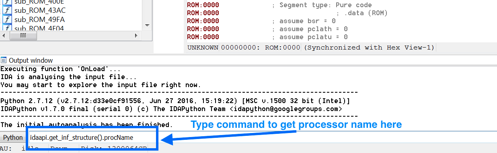

# IDAPython Embedded Toolkit
The IDAPython Embedded Toolkit is a set of script to automate many of the steps associated
with statically analyzing, or reverse engineering, the firmware of embedded devices in IDA Pro. 

## Presentations
The IDAPython Embedded Toolkit has been presented at the following venues:
* DerbyCon "IDAPython: The Wonder Woman of Embedded Device Reversing" -- September 2017<br/>
    Recording of Talk: http://www.irongeek.com/i.php?page=videos/derbycon7/t215-idapython-the-wonder-woman-of-embedded-device-reversing-maddie-stone <br/>
    Slides and Demo Videos from Presentation are available in the [presentations](presentations/) folder
* RECON Montreal "The Life-Changing Magic of IDAPython: Embedded Device Edition" -- June 2017 <br/>
    Recording of Talk: https://recon.cx/media-archive/2017/mtl/recon2017-mtl-20-maddie-stone-The-Life-Changing-Magic-of-IDAPython-Embedded-Device-Edition.mp4
    Slides and Demo Videos from Presentation are available in the [presentations](presentations/) folder

# Getting Started
To understand how and why the IDAPython Embedded Toolkit was created, check out the slides and recording from 
the DerbyCon or RECON Presentations. 

The IDAPython Embedded Toolkit is a set of IDAPython scripts written to be processor/architecture-agnostic
and automate the triage, analysis, and annotation processes associated with reversing the firmware 
image of an embedded device. The currently available scripts: 
* TRIAGE<a name="triage"></a>
    * [Define Code & Functions](https://github.com/maddiestone/IDAPythonEmbeddedToolkit/blob/master/define_code_functions.py)
    * [Define Data](https://github.com/maddiestone/IDAPythonEmbeddedToolkit/blob/master/define_data_as_types.py)
    * [Define Strings](https://github.com/maddiestone/IDAPythonEmbeddedToolkit/blob/master/make_strings.py)
* ANALYSIS<a name="analysis"></a>
    * [Calculate Indirect Offset Memory Accesses](https://github.com/maddiestone/IDAPythonEmbeddedToolkit/blob/master/data_offset_calc.py)
    * [Find Memory Accesses](https://github.com/maddiestone/IDAPythonEmbeddedToolkit/blob/master/find_mem_accesses.py)
* ANNOTATE<a name="annotate"></a>
    * [Identify GPIO Usage](https://github.com/maddiestone/IDAPythonEmbeddedToolkit/blob/master/identify_port_use_locations.py)
    * [Identify "Dead" Code](https://github.com/maddiestone/IDAPythonEmbeddedToolkit/blob/master/label_funcs_with_no_xrefs.py)
    * [Trace Operand Use](https://github.com/maddiestone/IDAPythonEmbeddedToolkit/blob/master/identify_operand_locations.py)

Each script is written to be processor/architecture-agnostic, but in some scripts, this requires a regular expression
to address each architecture's specific-syntax. Before running the scripts, verify that the architecture of the firmware 
image to be analyzed is supported in the script.Please see [Architecture Agnostic Structure of Scripts](#archagnostic) for more details.
The IDAPython Embedded Toolkit only becomes more powerful, the more processors that are supported, so please submit a pull request
as you add new processors.

To run a script, you must have IDA Pro 6.95 installed. Open the IDA database on which you'd like to run a script and then
select File > Script File... and select the script to run.

## Versioning
Currently, the IDAPython Embedded Toolkit has only been tested on IDA Pro 6.95. Testing on IDA 
Pro 7.0 is currently in process.
    
## Installation/ Usage
If you completed the default installation for IDA Pro, then IDAPython should be installed.
You can verify by checking your IDA directory for a Python/ folder. If that is there, IDAPython
is installed.

Otherwise, install IDAPython per: https://github.com/idapython/src

Once IDAPython is installed, the IDAPython Embedded Toolkit scripts may be run by opening an
IDA database and selecting File > Script file... from the upper menu. Then, select the script to run.
Each script is run individually by selecting it through this process.

## Architecture Agnostic Structure of Scripts<a name="archagnostic"></a>
The scripts in the IDAPython Embedded Toolkit are written to be architecture and processor-agnostic. 
This is done by finding the common structure and processes that are not dependent on architecture-specific syntax.
For the scripts that require processor-specific syntax (for example: Special Function Register Names or Instruction Syntax),
regular expressions are used for each architecture. For more information on how to write regular expressions in Python:
https://docs.python.org/2/library/re.html 

Thanks to the contribution by @tmr232, each script auto-identifies the architecture in use and selects the correct set of 
regular expressions using the IDAPython function: 
`processor_name = idaapi.get_inf_structure().procName `

### Add a Processor to a Script
If the processor-in-use does not have regular expressions defined within the script, then the script will exit with an 
"Unsupported Processor Type" error. To make the script work, you simply need to add the required regular expression. To do this:
1. Determine IDA's string representation of the processor. In the bottom console bar, type the following 
command as shown in the image below: `idaapi.get_inf_structure().procName` The command will output a string. That string is the processor name. <br/><br/>

<br/><br/>
2. Add an elif statement to the script with the processor name output in Step 1.
3. Copy the regular expression assignments from another one of the processor's and customize them for the new processor being added.
The Python documentation for regular expressions is [here.](https://docs.python.org/2/library/re.html) Each script that utilizes 
processor-specific regular expressions describes what the regular expression is describing in the header of the script. 

Example of the Regular Expressions for Processor-Specific Syntax in define_code_functions.py
```
################### USER DEFINED VALUES ###################
# Enter a regular expression for how this architecture usually 
# begins and ends functions. If the architecture does not 
# dictate how to start or end a function use r".*" to allow
# for any instruction.
#
processor_name = idaapi.get_inf_structure().procName

if processor_name == '8051':	# 8051 Architecture Prologue and Epilogue   	smart_prolog = re.compile(r".*")	
	smart_epilog = re.compile(r"reti{0,1}")
elif processor_name == 'PIC18Cxx':	# PIC18 Architecture Prologue and Epilogue	
	smart_prolog = re.compile(r".*")	
	smart_epilog = re.compile(r"return  0")
elif processor_name == 'm32r':	# Mitsubishi M32R Architecutre Prologue and Epilogue
	smart_prolog = re.compile(r"push +lr")
	smart_epilog = re.compile(r"jmp +lr.*")
elif processor_name == 'TMS32028':	# Texas Instruments TMS320C28x	
	smart_prolog = re.compile(r".*")	
	smart_epilog = re.compile(r"lretr")
elif processor_name == 'AVR':	# AVR	
	smart_prolog = re.compile(r"push +r")	
	smart_epilog = re.compile(r"reti{0,1}")
else:	
	print "[define_code_functions.py] UNSUPPORTED PROCESSOR. Processor = %s is unsupported. Exiting." % processor_name	
	raise NotImplementedError('Unsupported Processor Type.')
```

## Scripts in the IDAPython Embedded Toolkit
* **data_offset_calc.py -- Resolve Indirect Offset Memory Accesses**
Resolves the references to indirect offsets of a variable, register, or memory location
whose value is known. Changes the display of the operand in the instruction (OpAlt function),
creates a data cross references (add_dref), and creates a comment of the resolved address
(MakeComment). User nees to define the following:
		offset_var_string: The string representation of the variable, register, or memory
							location to be replaced by the resolved value
		offset_var_value:	The value of the variable defined in offset_var_string
		reg_ex_indirect:	A regular expression of how indirect offset accesses to the variable
		reg_ex_immediate:	A regular expression of how the immediate offset value is represented
		new_opnd_display:	A string representation of how the calculated and resolved 
							value should be displayed as the operand in the instruction

For example, let's say we have firmware where fp = 0x808000 and the majority of memory accesses are as 
offsets from fp. This script will calculate that the instruction is reading 0x80C114, create a cross-reference
to that location, and replace the operand in the instruction with this calculated value as shown below.
```
ld      R1, @(0x4114, fp)   -->     ld      R1, @[0x80C114]
add3    R10, fp, 0x4147     -->     add3    R10, fp, 0x4147;    @[0x80C147]
```

* **define_code_functions.py -- Define Code and Functions**
This script scans an area of the database from the user input "start address" to "end address"
defining the bytes as code and attempting to define functions from that code. The script
is architecture agnostic by having the user define a regular expression for the "function prologue"
and the "function epilogue" for the architecture being analyzed.

* **define_data_as_types.py -- Define a Block as Data**
Defines a segment of addresses as the user-specified data type (byte, word, or double word).
The byte length for each of these types is architecture dependent, but generally:
	1 byte  = Byte
      2 bytes = Word
	4 bytes = Double Word
This script with undefine all bytes in the range first which means if you previously had
code or strings defined in the area, they will be overwritten as data.

* **make_strings.py -- Define a Block as Strings**
This script is used to search for and declare blocks of "Unexplored" bytes as ASCII strings. 
The user inserts the starting and ending address of the areas to be analyzed. The script then
checks if each byte is an ASCII character value and ends with a defined "ending string character."
In this example, the ending string characters are 0xD, 0xA, and 0x00. The script only checks 
"undefined or unexplored" values in the database. For example, if a string is currently 
defined as code, it will not identify this string. This is to protect previously defined values. 

* **label_funcs_with_no_xrefs.py -- Label All Functions without Cross-References/ Valid Code Paths**
This script identifies what could be "dead code". It checks each function for cross-references to 
the function in question. If there are none, it adds the prefix "noXrefs_" to the function name. This
is very efficient for architectures that do not call functions indirectly.

* **identify_port_use_locations.py -- Find All CPU Port Usage**
Identifies all code using the CPU's ports and records the address and instruction
in the identified file. There is the option to annotate each function that accesses a CPU port/pin
with a prefix stating that it's using the specific port/pin.

* **find_mem_acceses.py -- Identify Memory Accesses**
Identifies the memory accesses used in the code. When a memory access is identified based
on the user contributed regular expression, this script completes three different actions
to help with the static analysis:
	1. 	A cross reference is created between the instruction and the memory address. This 
		will fail if the address doesn't currently exist because the segment was not created.
 	2. 	The value at the memory address is retrieved and added as a comment to the 
		referencing instruction.
	3. 	A dictionary of all of the memory addresses accessed and the referencing instructions'
		addresses are printed and saved to a file.
* **identify_operand_locations.py -- Identify Instructions that Reference an Operand**
Identifies the instructions in the range start_addr to end_addr that reference the 
input operand (regex_operand). The addresses of all instructions where the operand is 
found are printed to the IDA output window and saved to a file.

## Copyright
Copyright 2017 The Johns Hopkins University Applied Physics Laboratory LLC
All rights reserved.
Permission is hereby granted, free of charge, to any person obtaining a copy of this 
software and associated documentation files (the "Software"), to deal in the Software 
without restriction, including without limitation the rights to use, copy, modify, 
merge, publish, distribute, sublicense, and/or sell copies of the Software, and to 
permit persons to whom the Software is furnished to do so.

THE SOFTWARE IS PROVIDED "AS IS", WITHOUT WARRANTY OF ANY KIND, EXPRESS OR IMPLIED, 
INCLUDING BUT NOT LIMITED TO THE WARRANTIES OF MERCHANTABILITY, FITNESS FOR A PARTICULAR 
PURPOSE AND NONINFRINGEMENT. IN NO EVENT SHALL THE AUTHORS OR COPYRIGHT HOLDERS BE 
LIABLE FOR ANY CLAIM, DAMAGES OR OTHER LIABILITY, WHETHER IN AN ACTION OF CONTRACT, 
TORT OR OTHERWISE, ARISING FROM, OUT OF OR IN CONNECTION WITH THE SOFTWARE OR THE USE 
OR OTHER DEALINGS IN THE SOFTWARE.
